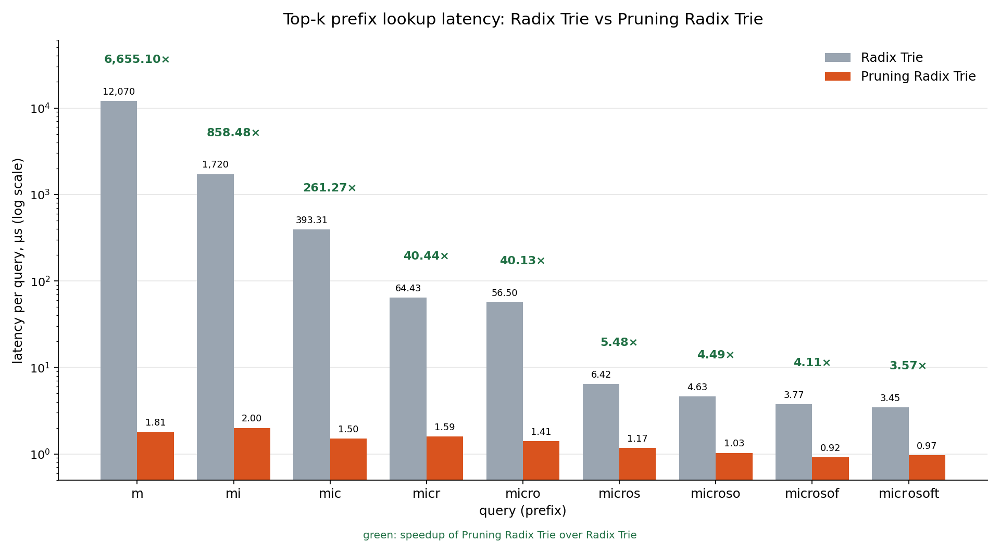

# pruning_radix_trie_rs

[](https://crates.io/crates/pruning_radix_trie_rs)
[](https://docs.rs/pruning_radix_trie_rs)
[](https://github.com/wolfgarbe/PruningRadixTrie/blob/master/LICENSE)
========
**pruning_radix_trie_rs - 1000x faster Radix trie** for prefix search & auto-complete

The PruningRadixTrie is a novel data structure, derived from a radix trie - but 3 orders of magnitude faster.

A [Radix Trie](https://en.wikipedia.org/wiki/Radix_tree) or Patricia Trie is a space-optimized trie (prefix tree).<br>
A **Pruning Radix trie** is a novel Radix trie algorithm, that allows pruning of the Radix trie and early termination of the lookup.

A mutable radix trie for frequency-ranked prefix completion. Each trie node
stores the maximum frequency in its subtree, allowing top-k searches to skip
branches that cannot improve the current results.

In many cases, we are not interested in a complete set of all children for a given prefix, but only in the top-k most relevant terms.
Especially for short prefixes, this results in a **massive reduction of lookup time** for the top-10 results.
On the other hand, a complete result set of millions of suggestions wouldn't be helpful at all for autocompletion.<br><br>
The lookup acceleration is achieved by storing in each node the maximum rank of all its children. By comparing this maximum child rank with the lowest rank of the results retrieved so far, we can heavily prune the trie and do early termination of the lookup for non-promising branches with low child ranks.

***

### Performance

| query | Radix Trie | Pruning Radix Trie | speedup |
|---:|---:|---:|---:|
| m | 12,070.00 µs | 1.81 µs | 6,655.10× |
| mi | 1,720.00 µs | 2.00 µs | 858.48× |
| mic | 393.31 µs | 1.50 µs | 261.27× |
| micr | 64.43 µs | 1.59 µs | 40.44× |
| micro | 56.50 µs | 1.41 µs | 40.13× |
| micros | 6.42 µs | 1.17 µs | 5.48× |
| microso | 4.63 µs | 1.03 µs | 4.49× |
| microsof | 3.77 µs | 0.92 µs | 4.11× |
| microsoft | 3.45 µs | 0.97 µs | 3.57× |


<br><br>
The **Pruning Radix Trie** is up to **6000x faster** than an ordinary Radix Trie.

While 12 ms for an autocomplete might seem fast enough for a single user, it becomes insufficient when we have to serve thousands of users in parallel. Then autocomplete lookups in large dictionaries are only feasible when powered by something much faster than an ordinary radix trie.

While a prefix of length=1 is not very useful for the Latin alphabet, it does make sense for CJK languages. Also, there are many more application fields for a fast prefix search algorithm beyond character-wise word completion: Instead of characters, the prefix can be composed of arbitrary items, e.g. 
whole words in a query completion, or towns in a long routing sequence.

## Features

- Insert terms with `u64` frequencies; inserting an existing term adds to its
  frequency.
- Find up to *k* completions for a prefix, ordered by descending frequency.
- Optionally enable early branch pruning during lookup.
- Read and write dictionaries as tab-separated `term<TAB>count` files.
- Supports Unicode terms and prefixes.
- No runtime dependencies.

### Dictionary

[Terms.txt](https://github.com/wolfgarbe/PruningRadixTrie/blob/master/PruningRadixTrie.Benchmark/terms.zip) contains 6 million unigrams and bigrams derived from English Wikipedia, with term frequency counts used for ranking. But you can use any frequency dictionary for any language and domain of your choice.

### Blog Posts
[The Pruning Radix Trie — a Radix trie on steroids](https://seekstorm.com/blog/pruning-radix-trie/)<br>
[1000x Faster Spelling Correction algorithm](https://seekstorm.com/blog/1000x-spelling-correction/)<br>
[SymSpell vs. BK-tree: 100x faster fuzzy string search & spell checking](https://seekstorm.com/blog/symspell-vs-bk-tree/)

### Application:
The PruningRadixTrie is perfect for auto-completion, query completion or any other prefix search in large dictionaries.
While 37 ms for an auto-complete might seem fast enough for a **single user**, it becomes a completely different story if we have to serve **thousands of users in parallel**. Then autocomplete lookups in large dictionaries become only feasible when powered by something much faster than an ordinary radix trie.

## Requirements

Rust 1.91 or later.

## Installation

Add the crate to your project:

```console
cargo add pruning_radix_trie_rs
```

Or add it to `Cargo.toml`:

```toml
[dependencies]
pruning_radix_trie_rs = "0.1"
```

## Quick start

```rust
use pruning_radix_trie_rs::PruningRadixTrie;

fn main() {
    let mut trie = PruningRadixTrie::new();
    trie.add_term("the", 100);
    trie.add_term("their", 70);
    trie.add_term("there", 50);
    trie.add_term("then", 10);

    let (completions, prefix_frequency) =
        trie.get_top_k_terms_for_prefix("the", 2, true);

    assert_eq!(
        completions,
        vec![("the".to_string(), 100), ("their".to_string(), 70)]
    );
    assert_eq!(prefix_frequency, 100);
}
```

`get_top_k_terms_for_prefix` returns a pair:

- A `Vec<(String, u64)>` containing up to `top_k` matching terms and their
  frequencies, in descending frequency order.
- The frequency of the prefix itself if it is a term, or `0` if it is not.
  This value is independent of whether the prefix made the top-k results.

```rust
let (results, prefix_frequency) =
    trie.get_top_k_terms_for_prefix("the", 10, true);
```

The final argument controls pruning. Use `true` for early termination when
searching; `false` disables it, for example when comparing search performance.
Set `top_k` to `0` to return all completions; in that mode results are
unordered and pruning is disabled.

## Building a dictionary from a file

Input and output use one `term<TAB>count` entry per line:

```text
apple    120
application    45
apply    80
```

The whitespace above represents a tab character. Malformed lines are skipped
when loading.

```rust
use pruning_radix_trie_rs::PruningRadixTrie;
use std::error::Error;

fn main() -> Result<(), Box<dyn Error>> {
    let mut trie = PruningRadixTrie::new();
    trie.read_terms_from_file("terms.txt")?;

    let (results, _) = trie.get_top_k_terms_for_prefix("app", 5, true);
    for (term, frequency) in results {
        println!("{term}\t{frequency}");
    }

    trie.add_term("apples", 12);
    trie.write_terms_to_file("terms.txt")?;
    Ok(())
}
```

`read_terms_from_file` adds terms to the current trie; it does not clear it.
Repeated terms, whether added directly or loaded from a file, have their
frequencies summed. File operations return `std::io::Result`.

## API overview

- `PruningRadixTrie::new()` creates an empty trie.
- `add_term(term, frequency)` inserts a term. Empty terms are ignored.
- `term_count()` returns the number of distinct terms.
- `get_top_k_terms_for_prefix(prefix, top_k, pruning)` returns matching
  completions and the prefix's own frequency.
- `read_terms_from_file(path)` loads tab-separated terms and counts.
- `write_terms_to_file(path)` writes terms and counts in the same format.

See the [API documentation](https://docs.rs/pruning_radix_trie_rs) for full
details.

## Development

Run the test suite:

```console
cargo test
```

Run the included benchmark:

```console
cargo bench --bench basic
```

The benchmark compares prefix lookups with pruning enabled and disabled using
the included term-frequency data.

## License

Licensed under the [MIT License](https://opensource.org/licenses/MIT).

### Official implementations

**Rust**<br>
https://github.com/wolfgarbe/pruning_radix_trie_rs

**C#**<br>
https://github.com/wolfgarbe/PruningRadixTrie


### Ports
The following third party ports or reimplementations to other programming languages have not been tested by myself whether they are an exact port, error free, provide identical results or are as fast as the original algorithm. 

**Go**<br>
https://github.com/olympos-labs/pruning-radix-trie

**Java**<br>
https://github.com/benldr/JPruningRadixTrie<br>

**Python**<br>
https://github.com/otto-de/PyPruningRadixTrie<br>

**Rust**<br>
https://github.com/wolfgarbe/pruning_radix_trie_rs<br>
https://github.com/peterall/pruning_radix_trie<br>

---

**pruning_radix_trie_rs** is contributed by [**SeekStorm** - the high performance Search as a Service & search API](https://seekstorm.com)

